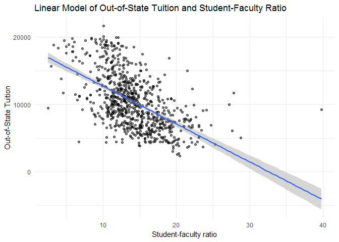
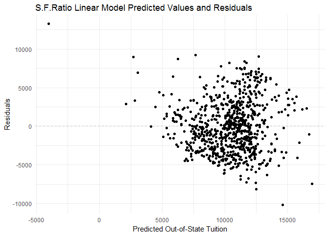
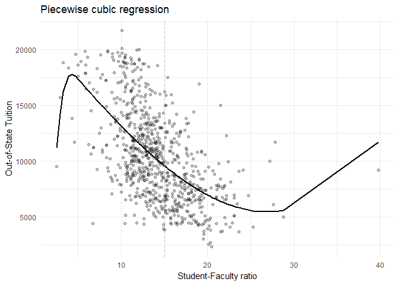
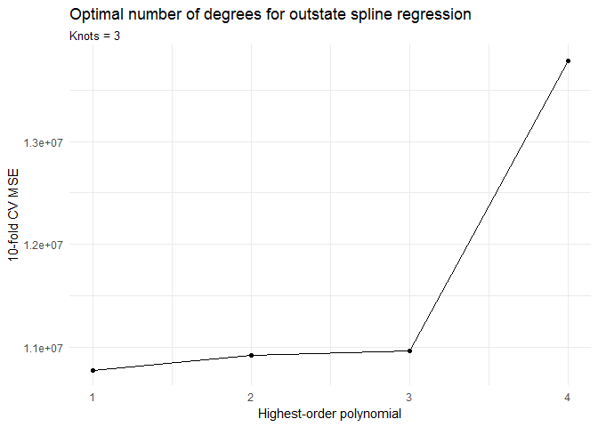
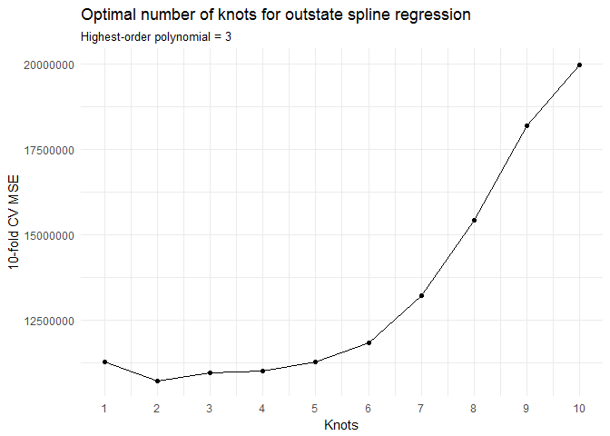
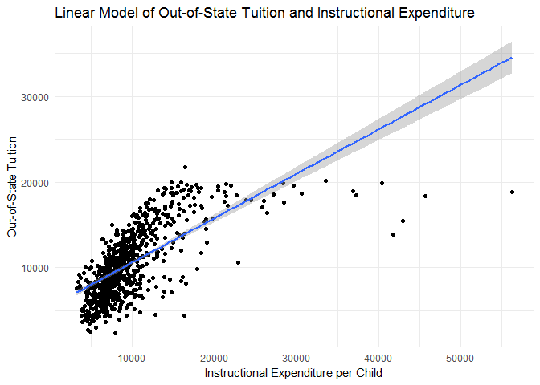
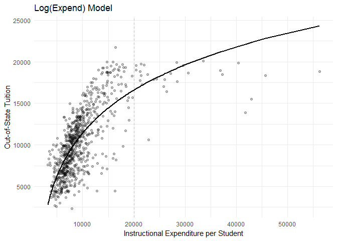
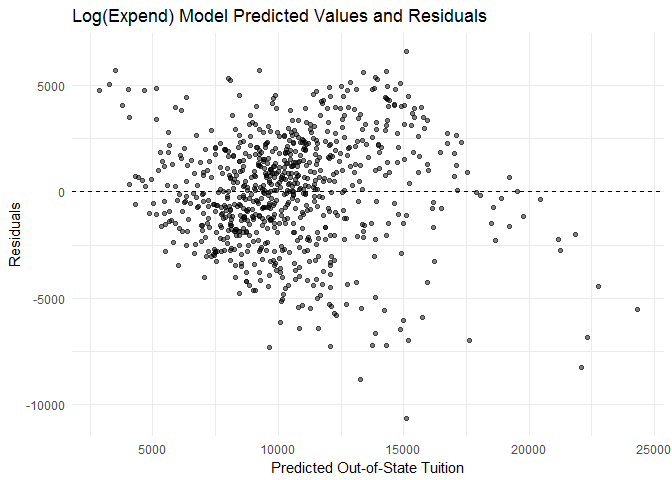
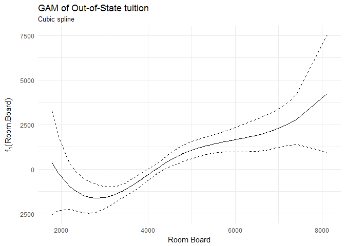
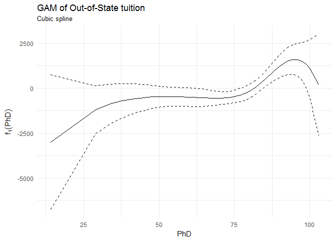

Problem set \#7: Resampling and non-linearity
================
ChengYee Lim
02/25/2017

-   [Part 1: Sexy Joe Biden \[4 points\]](#part-1-sexy-joe-biden-4-points)
-   [Part 2: College (Bivariate) \[3 points\]](#part-2-college-bivariate-3-points)
    -   [Top10perc and Out-of-State tuition](#top10perc-and-out-of-state-tuition)
    -   [Student Faculty Ratio and Tuition](#student-faculty-ratio-and-tuition)
    -   [Instructional Expenditure and Tuition](#instructional-expenditure-and-tuition)
-   [Part 3: College (GAM) \[3 points\]](#part-3-college-gam-3-points)
    -   [Model Fit](#model-fit)
    -   [Non-linear relationship](#non-linear-relationship)

``` r
knitr::opts_chunk$set(
  cache = TRUE, 
  message = FALSE, 
  warning = FALSE
  )

library(tidyverse)
library(modelr)
library(broom)
library(knitr)
library(pander)
library(purrr)
library(gam)

theme_set(theme_minimal())
set.seed(1234)
```

Part 1: Sexy Joe Biden \[4 points\]
===================================

For this exercise we consider the following functional form:

*Y* = *β*<sub>0</sub> + *β*<sub>1</sub>*X*<sub>1</sub> + *β*<sub>2</sub>*X*<sub>2</sub> + *β*<sub>3</sub>*X*<sub>3</sub> + *β*<sub>4</sub>*X*<sub>4</sub> + *β*<sub>5</sub>*X*<sub>5</sub> + *ϵ*

where *Y* is the Joe Biden feeling thermometer, *X*<sub>1</sub> is age, *X*<sub>2</sub> is gender, *X*<sub>3</sub> is education, *X*<sub>4</sub> is Democrat, and *X*<sub>5</sub> is Republican.

``` r
# import
joe <- read.csv("./data/biden.csv") %>%
  na.omit() %>%
  mutate(female = factor(female, levels = c(0,1), labels = c("Male", "Female"))) %>%
  mutate(dem = factor(dem, levels = c(0,1), labels = c("Non-Democrat", "Democrat"))) %>%
  mutate(rep = factor(rep, levels = c(0,1), labels = c("Non-Republican", "Republican"))) 

# functions 
#  MSE calculation
mse <- function(model, data) {
  x <- modelr:::residuals(model, data)
  mean(x ^ 2, na.rm = TRUE)
} 

#  linear model estimation
joe_lm <- function(df){
  lm <- lm(biden ~ age + female + educ + dem + rep , data = df)
} 
```

**Estimate the training MSE of the model using the traditional approach.**

``` r
pander(summary(joe_lm(joe)))
```

<table style="width:89%;">
<colgroup>
<col width="27%" />
<col width="15%" />
<col width="18%" />
<col width="13%" />
<col width="13%" />
</colgroup>
<thead>
<tr class="header">
<th align="center"> </th>
<th align="center">Estimate</th>
<th align="center">Std. Error</th>
<th align="center">t value</th>
<th align="center">Pr(&gt;|t|)</th>
</tr>
</thead>
<tbody>
<tr class="odd">
<td align="center"><strong>age</strong></td>
<td align="center">0.04826</td>
<td align="center">0.02825</td>
<td align="center">1.708</td>
<td align="center">0.08773</td>
</tr>
<tr class="even">
<td align="center"><strong>femaleFemale</strong></td>
<td align="center">4.103</td>
<td align="center">0.9482</td>
<td align="center">4.327</td>
<td align="center">1.593e-05</td>
</tr>
<tr class="odd">
<td align="center"><strong>educ</strong></td>
<td align="center">-0.3453</td>
<td align="center">0.1948</td>
<td align="center">-1.773</td>
<td align="center">0.07641</td>
</tr>
<tr class="even">
<td align="center"><strong>demDemocrat</strong></td>
<td align="center">15.42</td>
<td align="center">1.068</td>
<td align="center">14.44</td>
<td align="center">8.145e-45</td>
</tr>
<tr class="odd">
<td align="center"><strong>repRepublican</strong></td>
<td align="center">-15.85</td>
<td align="center">1.311</td>
<td align="center">-12.09</td>
<td align="center">2.157e-32</td>
</tr>
<tr class="even">
<td align="center"><strong>(Intercept)</strong></td>
<td align="center">58.81</td>
<td align="center">3.124</td>
<td align="center">18.82</td>
<td align="center">2.694e-72</td>
</tr>
</tbody>
</table>

<table style="width:85%;">
<caption>Fitting linear model: biden ~ age + female + educ + dem + rep</caption>
<colgroup>
<col width="20%" />
<col width="30%" />
<col width="11%" />
<col width="22%" />
</colgroup>
<thead>
<tr class="header">
<th align="center">Observations</th>
<th align="center">Residual Std. Error</th>
<th align="center"><span class="math inline"><em>R</em><sup>2</sup></span></th>
<th align="center">Adjusted <span class="math inline"><em>R</em><sup>2</sup></span></th>
</tr>
</thead>
<tbody>
<tr class="odd">
<td align="center">1807</td>
<td align="center">19.91</td>
<td align="center">0.2815</td>
<td align="center">0.2795</td>
</tr>
</tbody>
</table>

``` r
mse(joe_lm(joe), joe)
```

    ## [1] 395.2702

**Estimate the test MSE of the model using the validation set approach. How does this value compare to the training MSE from step 1?**

``` r
#training-test data split 
joe_split <- resample_partition(joe, c(test = 0.7, train = 0.3))
joe_train <- joe_split$train %>%
  tbl_df()
joe_test <- joe_split$test %>%
  tbl_df()

pander(summary(joe_lm(joe_train))) #results of 70/30 training/test split
```

<table style="width:89%;">
<colgroup>
<col width="27%" />
<col width="15%" />
<col width="18%" />
<col width="13%" />
<col width="13%" />
</colgroup>
<thead>
<tr class="header">
<th align="center"> </th>
<th align="center">Estimate</th>
<th align="center">Std. Error</th>
<th align="center">t value</th>
<th align="center">Pr(&gt;|t|)</th>
</tr>
</thead>
<tbody>
<tr class="odd">
<td align="center"><strong>age</strong></td>
<td align="center">0.05506</td>
<td align="center">0.05417</td>
<td align="center">1.016</td>
<td align="center">0.3099</td>
</tr>
<tr class="even">
<td align="center"><strong>femaleFemale</strong></td>
<td align="center">4.874</td>
<td align="center">1.768</td>
<td align="center">2.757</td>
<td align="center">0.006034</td>
</tr>
<tr class="odd">
<td align="center"><strong>educ</strong></td>
<td align="center">0.03847</td>
<td align="center">0.3884</td>
<td align="center">0.09906</td>
<td align="center">0.9211</td>
</tr>
<tr class="even">
<td align="center"><strong>demDemocrat</strong></td>
<td align="center">15.02</td>
<td align="center">2.047</td>
<td align="center">7.34</td>
<td align="center">7.955e-13</td>
</tr>
<tr class="odd">
<td align="center"><strong>repRepublican</strong></td>
<td align="center">-15.67</td>
<td align="center">2.444</td>
<td align="center">-6.413</td>
<td align="center">3.138e-10</td>
</tr>
<tr class="even">
<td align="center"><strong>(Intercept)</strong></td>
<td align="center">53.01</td>
<td align="center">6.049</td>
<td align="center">8.763</td>
<td align="center">2.5e-17</td>
</tr>
</tbody>
</table>

<table style="width:85%;">
<caption>Fitting linear model: biden ~ age + female + educ + dem + rep</caption>
<colgroup>
<col width="20%" />
<col width="30%" />
<col width="11%" />
<col width="22%" />
</colgroup>
<thead>
<tr class="header">
<th align="center">Observations</th>
<th align="center">Residual Std. Error</th>
<th align="center"><span class="math inline"><em>R</em><sup>2</sup></span></th>
<th align="center">Adjusted <span class="math inline"><em>R</em><sup>2</sup></span></th>
</tr>
</thead>
<tbody>
<tr class="odd">
<td align="center">543</td>
<td align="center">20.39</td>
<td align="center">0.2759</td>
<td align="center">0.2691</td>
</tr>
</tbody>
</table>

``` r
mse(joe_lm(joe_train), joe_test)
```

    ## [1] 389.9995

The test MSE, 389.9994597, is larger than the training MSE from step 1, `mse(joe_lm(joe), joe)`. This is because the model trained with 100% of the observations so MSE at all points is minimized. On the other hand, second model trained with 70% of the observations, thus MSE on the test set is likely to be higher than the training MSE.

| Model               |     MSE     |
|---------------------|:-----------:|
| 100% train          | 395.2701693 |
| 70% train, 30% test | 389.9994597 |

**Repeat the validation set approach 100 times, using 100 different splits of the observations into a training set and a validation set. Comment on the results obtained.**

``` r
for(i in 1:100){
  if(i == 1){
    joe_split <- resample_partition(joe, c(test = 0.7, train = 0.3))
    joe_train <- joe_split$train %>%
      tbl_df()
    joe_test <- joe_split$test %>%
      tbl_df()
    mse_list <- c(mse(joe_lm(joe_train), joe_test))
  }
  if(i!=1){
    joe_split <- resample_partition(joe, c(test = 0.7, train = 0.3))
    joe_train <- joe_split$train %>%
      tbl_df()
    joe_test <- joe_split$test %>%
      tbl_df()
    mse_list <- c(mse(joe_lm(joe_train), joe_test), mse_list)
  }
}

mean(mse_list)
```

    ## [1] 401.4357

When the validation set approach is repeated 100 times, the average MSE is 401.4357125. Expectedly, the average MSE is still larger than the training MSE as explained in part (b). The average MSE is also slightly smaller than test MSE, this shows that a different split to form the test and training sets will result in different MSE. Repeating the validation approach will result in a more robust MSE.

| Model                          |     MSE     |
|--------------------------------|:-----------:|
| 100% train                     | 395.2701693 |
| 70% train, 30% test            | 397.3651852 |
| 70% train, 30% test, 100 times | 401.4357125 |

**Estimate the test MSE of the model using the leave-one-out cross-validation (LOOCV) approach. Comment on the results obtained.**

``` r
LOOCV <- function(df, n){
  #create loocv data
  loocv_data <- crossv_kfold(df, n)
  #regress every loocv datapoint
  loocv_mods <- map(loocv_data$train, ~ lm(biden ~ . , data = .))
  #calculate mse for every loocv datapoint
  loocv_mse <- map2_dbl(loocv_mods, loocv_data$test, mse)
  #mse of loocv is the average of every mse calculated
  mean(loocv_mse, na.rm = TRUE)
} #function to calculate mse for k-fold loocv approach, where max k = nrow(df)

LOOCV(joe, nrow(joe))
```

    ## [1] 397.9555

The test MSE of the model using LOOCV is 397.9555046. Since LOOCV trains with 99% of the observations, we expect the test MSE to be larger than the training MSE, and smaller than the MSE of the 70-30 validation set approach.

| Model               |     MSE     |
|---------------------|:-----------:|
| 100% train          | 395.2701693 |
| 70% train, 30% test | 397.3651852 |
| LOOCV               | 397.9555046 |

**Estimate the test MSE of the model using the 10-fold cross-validation approach. Comment on the results obtained.**

``` r
LOOCV(joe, 10)
```

    ## [1] 397.9992

The test MSE using the 10-fold cross-validation approach is 397.6861377. Since 10-fold cross-validation approach uses 90% of the observations for training, the test MSE will be larger than the training MSE and the LOOCV MSE but smaller than the 70-30 validation set approach MSE. There is, however, no significant difference between LOOCV MSE and 10-fold CV MSE.

| Model               |     MSE     |
|---------------------|:-----------:|
| 100% train          | 395.2701693 |
| 70% train, 30% test | 397.3651852 |
| LOOCV               | 397.9555046 |
| 10-fold CV          | 397.9392956 |

**Repeat the 10-fold cross-validation approach 100 times, using 100 different splits of the observations into 10-folds. Comment on the results obtained.**

``` r
for(i in 1:100){
  if(i == 1){
    cv_list <- c(LOOCV(joe, 10))
  }
  if(i!=1){
    cv_list <- c(LOOCV(joe, 10), cv_list)
  }
}
mean(cv_list)
```

    ## [1] 397.9969

The average MSE for 10-fold CV approach is almost identical as the LOOCV approach, thus the accuracy of both approaches are similar. Since LOOCV approach is much more time-inefficient, we would choose the 10-fold CV approach over LOOCV approach in this case.

| Model                 |     MSE     |
|-----------------------|:-----------:|
| 100% train            | 395.2701693 |
| 70% train, 30% test   | 397.3651852 |
| LOOCV                 | 397.9555046 |
| 10-fold CV            | 397.6697052 |
| 10-fold CV, 100 times | 397.9969014 |

**Compare the estimated parameters and standard errors from the original model in step 1 (the model estimated using all of the available data) to parameters and standard errors estimated using the bootstrap (*n* = 1000).**

``` r
#basic model 
pander(summary(joe_lm(joe)))
```

<table style="width:89%;">
<colgroup>
<col width="27%" />
<col width="15%" />
<col width="18%" />
<col width="13%" />
<col width="13%" />
</colgroup>
<thead>
<tr class="header">
<th align="center"> </th>
<th align="center">Estimate</th>
<th align="center">Std. Error</th>
<th align="center">t value</th>
<th align="center">Pr(&gt;|t|)</th>
</tr>
</thead>
<tbody>
<tr class="odd">
<td align="center"><strong>age</strong></td>
<td align="center">0.04826</td>
<td align="center">0.02825</td>
<td align="center">1.708</td>
<td align="center">0.08773</td>
</tr>
<tr class="even">
<td align="center"><strong>femaleFemale</strong></td>
<td align="center">4.103</td>
<td align="center">0.9482</td>
<td align="center">4.327</td>
<td align="center">1.593e-05</td>
</tr>
<tr class="odd">
<td align="center"><strong>educ</strong></td>
<td align="center">-0.3453</td>
<td align="center">0.1948</td>
<td align="center">-1.773</td>
<td align="center">0.07641</td>
</tr>
<tr class="even">
<td align="center"><strong>demDemocrat</strong></td>
<td align="center">15.42</td>
<td align="center">1.068</td>
<td align="center">14.44</td>
<td align="center">8.145e-45</td>
</tr>
<tr class="odd">
<td align="center"><strong>repRepublican</strong></td>
<td align="center">-15.85</td>
<td align="center">1.311</td>
<td align="center">-12.09</td>
<td align="center">2.157e-32</td>
</tr>
<tr class="even">
<td align="center"><strong>(Intercept)</strong></td>
<td align="center">58.81</td>
<td align="center">3.124</td>
<td align="center">18.82</td>
<td align="center">2.694e-72</td>
</tr>
</tbody>
</table>

<table style="width:85%;">
<caption>Fitting linear model: biden ~ age + female + educ + dem + rep</caption>
<colgroup>
<col width="20%" />
<col width="30%" />
<col width="11%" />
<col width="22%" />
</colgroup>
<thead>
<tr class="header">
<th align="center">Observations</th>
<th align="center">Residual Std. Error</th>
<th align="center"><span class="math inline"><em>R</em><sup>2</sup></span></th>
<th align="center">Adjusted <span class="math inline"><em>R</em><sup>2</sup></span></th>
</tr>
</thead>
<tbody>
<tr class="odd">
<td align="center">1807</td>
<td align="center">19.91</td>
<td align="center">0.2815</td>
<td align="center">0.2795</td>
</tr>
</tbody>
</table>

``` r
#bootstrap
joe %>%
  modelr::bootstrap(1000) %>%
  mutate(model = map(strap, ~ lm(biden ~ age + female + educ + dem + rep , data = .)),
         coef = map(model, tidy)) %>%
  unnest(coef) %>%
  group_by(term) %>%
  summarize(est.boot = mean(estimate),
            se.boot = sd(estimate, na.rm = TRUE)) %>%
  kable()
```

| term          |     est.boot|    se.boot|
|:--------------|------------:|----------:|
| (Intercept)   |   58.9147291|  2.9806875|
| age           |    0.0477486|  0.0287220|
| demDemocrat   |   15.4262392|  1.1076111|
| educ          |   -0.3496379|  0.1924320|
| femaleFemale  |    4.0888418|  0.9462701|
| repRepublican |  -15.8760448|  1.4434350|

The estimated parameters using the bootstrap is almost identical as the estimated parameters from the original model. However, the estimated standard errors from the bootstrap are consistently larger than the standard errors from the original model.

Part 2: College (Bivariate) \[3 points\]
========================================

``` r
college <- read.csv("./data/college.csv")
```

#### Top10perc and Out-of-State tuition

The initial scatterplot of `Top10perc` and `Outstate` suggests a relationship between `Top10perc` and `Outstate`. This is also corroborated with the residual plot of the linear model (`Outstate` ~ `Top10perc`). If there is a linear relationship between `Top10perc` and `Outstate`, the residuals of the observations should be distributed normally with an expected error *E*(*ϵ*)=0 and not be correlated with fitted values.

``` r
college %>% 
  ggplot(aes(x = Top10perc, y = Outstate)) + 
  geom_point(alpha = 1/4) + 
  geom_smooth(method = "lm") + 
  labs(
    title = "Relationship between new students from top 10% and Out-of-State Tuition", 
    y = "Out-of-State tuition", 
    x = "Percentage of new students from top 10% of H.S. Class"
  )
```


``` r
top10_mod <- lm(Outstate ~ Top10perc, data = college)
pander(summary(top10_mod))
```

<table style="width:86%;">
<colgroup>
<col width="25%" />
<col width="15%" />
<col width="18%" />
<col width="13%" />
<col width="13%" />
</colgroup>
<thead>
<tr class="header">
<th align="center"> </th>
<th align="center">Estimate</th>
<th align="center">Std. Error</th>
<th align="center">t value</th>
<th align="center">Pr(&gt;|t|)</th>
</tr>
</thead>
<tbody>
<tr class="odd">
<td align="center"><strong>Top10perc</strong></td>
<td align="center">128.2</td>
<td align="center">6.774</td>
<td align="center">18.93</td>
<td align="center">5.459e-66</td>
</tr>
<tr class="even">
<td align="center"><strong>(Intercept)</strong></td>
<td align="center">6906</td>
<td align="center">221.6</td>
<td align="center">31.16</td>
<td align="center">7.504e-139</td>
</tr>
</tbody>
</table>

<table style="width:85%;">
<caption>Fitting linear model: Outstate ~ Top10perc</caption>
<colgroup>
<col width="20%" />
<col width="30%" />
<col width="11%" />
<col width="22%" />
</colgroup>
<thead>
<tr class="header">
<th align="center">Observations</th>
<th align="center">Residual Std. Error</th>
<th align="center"><span class="math inline"><em>R</em><sup>2</sup></span></th>
<th align="center">Adjusted <span class="math inline"><em>R</em><sup>2</sup></span></th>
</tr>
</thead>
<tbody>
<tr class="odd">
<td align="center">777</td>
<td align="center">3329</td>
<td align="center">0.3162</td>
<td align="center">0.3153</td>
</tr>
</tbody>
</table>

``` r
college %>%
  add_predictions(top10_mod) %>%
  add_residuals(top10_mod) %>%
  ggplot(aes(x = pred, y = resid)) +
  geom_point(alpha = 1/4) +
  geom_hline(yintercept = 0, linetype = 2, color = "black") + 
  labs(title = "Top10perc Linear Model Predicted Values and Residuals",
       x = "Predicted Out-of-State Tuition",
       y = "Residuals")   
```


We then affirm the non-transformation of `Top10perc` with a 10-fold cross validation on the number of polynomial. From the results of the 10-fold cross validation, it appears that 10-fold CV MSE is minimized with a second ordered polynomial. Since MSE is only reduced by 0.2%, we will still use the non-transformed `Top10perc` model.

**Summary of the Findings**
A percent increase in percentage of new students from the top 10% of the H.S. cohort corresponds to an increase of $128.2 in out-of-state tuition.

#### Student Faculty Ratio and Tuition

The initial scatterplot of `S.F.Ratio` and `Outstate` shows a non-linear relationship between the two variables. This is also corroborated with the residual plot of the linear model (`Outstate` ~ `S.F.Ratio`). If there is a linear relationship between `Expend` and `Outstate`, the residuals of the observations should be distributed normally with an expected error *E*(*ϵ*)=0 and not be correlated with fitted values. However, the residual plots of the linear model do not appear to be normally distributed around 0.

``` r
college %>%
  ggplot(aes(x = S.F.Ratio, y = Outstate)) +
  geom_point(alpha = 1/2) + 
  geom_smooth(method = "lm") + 
  labs(title = "Linear Model of Out-of-State Tuition and Student-Faculty Ratio",
       x = "Student-faculty ratio",
       y = "Out-of-State Tuition") 
```



``` r
sf_mod <- lm(Outstate ~ S.F.Ratio, data = college) 

college %>% 
  add_residuals(sf_mod) %>%
  add_predictions(sf_mod) %>%
  ggplot(aes(x = pred, y = resid)) +
  geom_hline(yintercept = 0, linetype = 2, color = "grey") + 
  geom_point() + 
  labs(title = "S.F.Ratio Linear Model Predicted Values and Residuals",
       x = "Predicted Out-of-State Tuition",
       y = "Residuals") 
```



Thus, we model a `Outstate` regression spline to fit separate polynomial functions over different regions of `S.F.Ratio`. The residual plot appears to be uncorrelated with fitted `Outstate` values and normally distributed around zero.

``` r
sf_smooth <- lm(Outstate ~ bs(S.F.Ratio, knots = c(5)), data = college)

college %>% 
  add_predictions(sf_smooth) %>%
  ggplot(aes(S.F.Ratio)) + 
  geom_point(aes(y = Outstate), alpha = 1/4) + 
  geom_line(aes(y= pred), size = 0.8, color = "black") + 
  geom_vline(xintercept = 15, linetype = 2, color = "grey") +
  labs(title = "Piecewise cubic regression",
       x = "Student-Faculty ratio",
       y = "Out-of-State Tuition") +
  theme(legend.position = "none")
```



``` r
college %>%
  add_residuals(sf_smooth) %>% 
  add_predictions(sf_smooth) %>%
  ggplot(aes(x = pred, y = resid)) + 
  geom_hline(yintercept = 0, linetype = 2, color = "grey") + 
  geom_point() + 
  labs(title = "Outstate Spline Regression Predicted Values and Residuals",
       x = "Predicted Out-of-State Tuition",
       y = "Residuals") 
```


We then affirm the choice of knots and of non-linear techniques with a 10-fold cross validation. From the results of the 10-fold cross validation, it appears that 10-fold CV MSE is minimized with a first order polynomial and when knots = 2. This affirms the choice of polynomials and knots we modelled.

``` r
# function to simplify things
wage_spline_cv <- function(data, degree = 3, df = NULL){
  # estimate the model on each fold
  models <- map(data$train, ~ lm(Outstate ~ bs(S.F.Ratio, df = df, degree = degree),
                                  data = .))
  
  # calculate mse for each test fold
  models_mse <- map2_dbl(models, data$test, mse)
  
  return(mean(models_mse, na.rm = TRUE))
}

# fold the data
wage_kfold <- crossv_kfold(college, k = 10)

# estimate mse for polynomial degrees in 1:10
wage_degree_mse <- data_frame(degrees = 1:4,
                              mse = map_dbl(degrees, ~ wage_spline_cv(wage_kfold, degree = .,
                                                                      df = 3 + .)))

# estimate mse for degrees of freedom (aka knots)
wage_df_mse <- data_frame(df = 1:10,
                          mse = map_dbl(df, ~ wage_spline_cv(wage_kfold, df = 3 + .)))

# graph the results
ggplot(wage_degree_mse, aes(degrees, mse)) +
  geom_point() +
  geom_line() +
  scale_x_continuous(breaks = 1:10) +
  labs(title = "Optimal number of degrees for outstate spline regression",
       subtitle = "Knots = 3",
       x = "Highest-order polynomial",
       y = "10-fold CV MSE") 
```



``` r
ggplot(wage_df_mse, aes(df, mse)) +
  geom_point() +
  geom_line() +
  scale_x_continuous(breaks = 1:10) +
  labs(title = "Optimal number of knots for outstate spline regression",
       subtitle = "Highest-order polynomial = 3",
       x = "Knots",
       y = "10-fold CV MSE")
```



#### Instructional Expenditure and Tuition

The initial scatterplot of `Expend` and `Outstate` suggests a monotonic transformation of `Expend` to `log(Expend)` according to the "Bulging Rule" by Tukey and Mostellar to induce linearity between the two variables. This is also corroborated with the residual plot of the linear model (`Outstate` ~ `Expend`). If there is a linear relationship between `Expend` and `Outstate`, the residuals of the observations should be distributed normally with an expected error *E*(*ϵ*)=0 and not be correlated with fitted values. However, the residual plots of the linear model do not appear to be normally distributed around 0. The residuals are also more correlated with fitted out-of-state tuition values from $75,000 and $150,000.

``` r
college %>%
  ggplot(aes(x = Expend, y = Outstate)) + 
  geom_point() + 
  geom_smooth(method = "lm") + 
  labs(title = "Linear Model of Out-of-State Tuition and Instructional Expenditure",
       x = "Instructional Expenditure per Child",
       y = "Out-of-State Tuition") 
```



``` r
expend <- lm(Outstate ~ Expend, data = college) 
pander(summary(expend))
```

<table style="width:86%;">
<colgroup>
<col width="25%" />
<col width="15%" />
<col width="18%" />
<col width="13%" />
<col width="13%" />
</colgroup>
<thead>
<tr class="header">
<th align="center"> </th>
<th align="center">Estimate</th>
<th align="center">Std. Error</th>
<th align="center">t value</th>
<th align="center">Pr(&gt;|t|)</th>
</tr>
</thead>
<tbody>
<tr class="odd">
<td align="center"><strong>Expend</strong></td>
<td align="center">0.5183</td>
<td align="center">0.02047</td>
<td align="center">25.32</td>
<td align="center">1.63e-103</td>
</tr>
<tr class="even">
<td align="center"><strong>(Intercept)</strong></td>
<td align="center">5434</td>
<td align="center">224.8</td>
<td align="center">24.17</td>
<td align="center">1.258e-96</td>
</tr>
</tbody>
</table>

<table style="width:85%;">
<caption>Fitting linear model: Outstate ~ Expend</caption>
<colgroup>
<col width="20%" />
<col width="30%" />
<col width="11%" />
<col width="22%" />
</colgroup>
<thead>
<tr class="header">
<th align="center">Observations</th>
<th align="center">Residual Std. Error</th>
<th align="center"><span class="math inline"><em>R</em><sup>2</sup></span></th>
<th align="center">Adjusted <span class="math inline"><em>R</em><sup>2</sup></span></th>
</tr>
</thead>
<tbody>
<tr class="odd">
<td align="center">777</td>
<td align="center">2978</td>
<td align="center">0.4526</td>
<td align="center">0.4519</td>
</tr>
</tbody>
</table>

``` r
college %>%
  add_residuals(expend) %>%
  add_predictions(expend) %>% 
  ggplot(aes(x = pred, y = resid)) + 
  geom_point(alpha = 1/2) + 
  geom_hline(yintercept = 0, linetype = 2, color = "black") +
  labs(title = "Expend Linear Model Predicted Values and Residuals",
       x = "Predicted Out-of-State Tuition",
       y = "Residuals") 
```


Plotting the log(`Expend`) model with the scatterplot of `Expend` and `Outstate` does appear to be a better fit than the linear model, at first glance. The residual plots also seem to be normally distributed around zero and be uncorrelated with the fitted values.

``` r
expend_log <- lm(Outstate ~ log(Expend), data = college)
pander(summary(expend_log))
```

<table style="width:86%;">
<colgroup>
<col width="25%" />
<col width="15%" />
<col width="18%" />
<col width="13%" />
<col width="13%" />
</colgroup>
<thead>
<tr class="header">
<th align="center"> </th>
<th align="center">Estimate</th>
<th align="center">Std. Error</th>
<th align="center">t value</th>
<th align="center">Pr(&gt;|t|)</th>
</tr>
</thead>
<tbody>
<tr class="odd">
<td align="center"><strong>log(Expend)</strong></td>
<td align="center">7482</td>
<td align="center">229.9</td>
<td align="center">32.54</td>
<td align="center">4.059e-147</td>
</tr>
<tr class="even">
<td align="center"><strong>(Intercept)</strong></td>
<td align="center">-57502</td>
<td align="center">2090</td>
<td align="center">-27.51</td>
<td align="center">8.347e-117</td>
</tr>
</tbody>
</table>

<table style="width:85%;">
<caption>Fitting linear model: Outstate ~ log(Expend)</caption>
<colgroup>
<col width="20%" />
<col width="30%" />
<col width="11%" />
<col width="22%" />
</colgroup>
<thead>
<tr class="header">
<th align="center">Observations</th>
<th align="center">Residual Std. Error</th>
<th align="center"><span class="math inline"><em>R</em><sup>2</sup></span></th>
<th align="center">Adjusted <span class="math inline"><em>R</em><sup>2</sup></span></th>
</tr>
</thead>
<tbody>
<tr class="odd">
<td align="center">777</td>
<td align="center">2617</td>
<td align="center">0.5774</td>
<td align="center">0.5769</td>
</tr>
</tbody>
</table>

``` r
college_exp <- college %>% 
  add_predictions(expend_log) %>%
  add_residuals(expend_log)

college_exp %>%
  ggplot(aes(Expend)) + 
  geom_point(aes(y = Outstate), alpha = 1/4) + 
  geom_line(aes(y= pred), size = 1) + 
  geom_vline(xintercept = 20000, linetype = 2, color = "grey") +
  labs(title = "Log(Expend) Model",
       x = "Instructional Expenditure per Student",
       y = "Out-of-State Tuition") +
  theme(legend.position = "none")
```



``` r
college_exp %>%
  ggplot(aes(x = pred, y = resid)) + 
  geom_point(alpha = 1/2) + 
  geom_hline(yintercept = 0, linetype = 2, color = "black") + 
  labs(title = "Log(Expend) Model Predicted Values and Residuals",
       x = "Predicted Out-of-State Tuition",
       y = "Residuals") +
  theme(legend.position = "none")
```



We then affirm the use of non-linear techniques with a 10-fold cross validation on the number of polynomial. From the results of the 10-fold cross validation, it appears that 10-fold CV MSE is minimized with a fourth ordered polynomial. However, higher order polynomials are often harder to interpret and MSE is only reduced by 7% from first order polynomial to fourth order polynomial. Thus, we choose to retain the ease in interpreting our results with a log(`Expend`) model.

**Summary of Findings**
From the results of the log(`Expend`) model, a one percent increase in instructional expenditure per student corresponds with with a 7.482 increase in out-of-state tuition.

``` r
college_kfold <- crossv_kfold(college, k = 10)
cv_error_fold10 <- vector("numeric", 7)
terms <- 1:7

for(i in terms){
  cv10_models <- map(college_kfold$train, ~ lm(Outstate ~ poly(log(Expend), i), data = .))
  cv10_mse <- map2_dbl(cv10_models, college_kfold$test, mse)
  cv_error_fold10[[i]] <- mean(cv10_mse)
}

cv_error_fold10
```

    ## [1] 6885033 6867260 6432525 6369127 6434193 6376210 6386851

``` r
data_frame(terms = terms, 
           fold10mse = cv_error_fold10) %>%
  ggplot(aes(x = terms, y = fold10mse)) +
  geom_line() + 
  scale_x_continuous(breaks = 1:10) +
  labs(title = "Optimal number of degrees for log(Expend)",
       x = "Highest-order polynomial",
       y = "10-fold CV MSE") 
```


Part 3: College (GAM) \[3 points\]
==================================

We now fit a GAM to predict out-of-state tuition using spline functions of `Room.Board`, `PhD`, `perc.alumni`, `Expend`, `Grad.Rate` and treating `Private` as a qualitative predictor.

-   `Outstate` - Out-of-state tuition.
-   `Private` - A factor with levels `No` and `Yes` indicating private or public university.
-   `Room.Board` - Room and board costs.
-   `PhD` - Percent of faculty with Ph.D.'s.
-   `perc.alumni` - Percent of alumni who donate.
-   `Expend` - Instructional expenditure per student.
-   `Grad.Rate` - Graduation rate.

We do so by extending the following multiple linear regression model

*y*<sub>*i*</sub> = *β*<sub>0</sub> + *β*<sub>1</sub>*X*<sub>*i*1</sub> + *β*<sub>2</sub>*X*<sub>*i*2</sub> + *β*<sub>3</sub>*X*<sub>*i*3</sub> + *β*<sub>4</sub>*X*<sub>*i*4</sub> + *β*<sub>5</sub>*X*<sub>*i*5</sub> + *β*<sub>6</sub>*X*<sub>*i*6</sub> + *ϵ*<sub>*i*</sub>

where *X*<sub>*i*1</sub> is `Private`, *X*<sub>*i*2</sub> is `Room.Board`, *X*<sub>*i*3</sub> is `PhD`, *X*<sub>*i*4</sub> is `perc.alumni`, *X*<sub>*i*5</sub> is `Expend`, and *X*<sub>*i*6</sub> is `Grad.Rate`

and allowing for non-linear relationships between each predictor and the response variable. Each linear component *β*<sub>*j*</sub>*x*<sub>*i**j*</sub> is replaced with a smooth, non-linear function *f*<sub>*j*</sub>(*x*<sub>*i**j*</sub>):

$$y\_i = \\beta\_0 + \\sum\_{j = 1}^6 f\_j(x\_{ij}) + \\epsilon\_i$$

We also retain the log-transformation of `Expend` for the explained reasons in part 2, thus our ultimate GAM for the college dataset is as follows:

Outstate = *β*<sub>0</sub> + *f*<sub>1</sub>(Private)+*f*<sub>2</sub>(Room.Board)+*f*<sub>3</sub>(PhD)+*f*<sub>4</sub>(perc.alumni)+*β*<sub>1</sub>*l**o**g*(Expend)+*f*<sub>5</sub>(Grad.Rate)+*ϵ*

Where *f*<sub>2</sub>, *f*<sub>3</sub>, *f*<sub>4</sub>, *f*<sub>5</sub> are cubic splines with 2 knots and *f*<sub>1</sub> generates a separate constant for non-private and private universities using traditional dummy variables.

``` r
# training-test set split
college_split <- resample_partition(college, c(test = 0.7, train = 0.3))
college_train <- college_split$train %>%
  tbl_df()
college_test <- college_split$test %>%
  tbl_df()

# OLS estimation
college_mod <- lm(Outstate ~ Private + Room.Board + PhD + perc.alumni +  Expend + Grad.Rate, data = college_train)
pander(summary(college_mod))
```

<table style="width:86%;">
<colgroup>
<col width="25%" />
<col width="15%" />
<col width="18%" />
<col width="13%" />
<col width="13%" />
</colgroup>
<thead>
<tr class="header">
<th align="center"> </th>
<th align="center">Estimate</th>
<th align="center">Std. Error</th>
<th align="center">t value</th>
<th align="center">Pr(&gt;|t|)</th>
</tr>
</thead>
<tbody>
<tr class="odd">
<td align="center"><strong>PrivateYes</strong></td>
<td align="center">2519</td>
<td align="center">401.8</td>
<td align="center">6.269</td>
<td align="center">1.813e-09</td>
</tr>
<tr class="even">
<td align="center"><strong>Room.Board</strong></td>
<td align="center">1.181</td>
<td align="center">0.1566</td>
<td align="center">7.54</td>
<td align="center">1.117e-12</td>
</tr>
<tr class="odd">
<td align="center"><strong>PhD</strong></td>
<td align="center">39.92</td>
<td align="center">10.84</td>
<td align="center">3.683</td>
<td align="center">0.0002876</td>
</tr>
<tr class="even">
<td align="center"><strong>perc.alumni</strong></td>
<td align="center">29.52</td>
<td align="center">13.68</td>
<td align="center">2.158</td>
<td align="center">0.032</td>
</tr>
<tr class="odd">
<td align="center"><strong>Expend</strong></td>
<td align="center">0.2002</td>
<td align="center">0.0328</td>
<td align="center">6.103</td>
<td align="center">4.454e-09</td>
</tr>
<tr class="even">
<td align="center"><strong>Grad.Rate</strong></td>
<td align="center">32.6</td>
<td align="center">9.691</td>
<td align="center">3.364</td>
<td align="center">0.0009007</td>
</tr>
<tr class="odd">
<td align="center"><strong>(Intercept)</strong></td>
<td align="center">-4248</td>
<td align="center">811.7</td>
<td align="center">-5.233</td>
<td align="center">3.782e-07</td>
</tr>
</tbody>
</table>

<table style="width:85%;">
<caption>Fitting linear model: Outstate ~ Private + Room.Board + PhD + perc.alumni + Expend + Grad.Rate</caption>
<colgroup>
<col width="20%" />
<col width="30%" />
<col width="11%" />
<col width="22%" />
</colgroup>
<thead>
<tr class="header">
<th align="center">Observations</th>
<th align="center">Residual Std. Error</th>
<th align="center"><span class="math inline"><em>R</em><sup>2</sup></span></th>
<th align="center">Adjusted <span class="math inline"><em>R</em><sup>2</sup></span></th>
</tr>
</thead>
<tbody>
<tr class="odd">
<td align="center">234</td>
<td align="center">2112</td>
<td align="center">0.7499</td>
<td align="center">0.7433</td>
</tr>
</tbody>
</table>

Out-of-state tuition is expected to be $2548 higher for private colleges than public colleges, holding all other independent variables constant. This is unsurprising as public colleges receive additional funding from the government, thus they do not need to charge college tuition as high as private colleges.

An additional dollar increase in room and boarding costs corresponds to an $1.06 increase in out-of-state tuition. Similarly, one percent increase in the percentage of the PhDs in the faculty corresponds with a $38.5 increase in out-of-state tuition. One percent increase in the percentage of alumni who donates also corresponds to a $44.13 increase in out-of-state tuition. A dollar increase in instructional expenditure per student corresponds with a $0.1508 increase in out-of-state tuition. A unit increase in graduation rate of the college also corresponds with $53.91 increase in out-of-state tuition.

``` r
# estimate model for splines on private, room boarding, PhD, alumni, expenditure, graduation rate 
college_gam <- gam(Outstate ~ Private + bs(Room.Board, df = 5) + bs(PhD, df = 5) + bs(perc.alumni, df = 5) + log(Expend) + bs(Grad.Rate, df = 5), data = college_train)
summary(college_gam)
```

    ## 
    ## Call: gam(formula = Outstate ~ Private + bs(Room.Board, df = 5) + bs(PhD, 
    ##     df = 5) + bs(perc.alumni, df = 5) + log(Expend) + bs(Grad.Rate, 
    ##     df = 5), data = college_train)
    ## Deviance Residuals:
    ##    Min     1Q Median     3Q    Max 
    ##  -7195  -1142    168   1195   4755 
    ## 
    ## (Dispersion Parameter for gaussian family taken to be 3737510)
    ## 
    ##     Null Deviance: 4048626784 on 233 degrees of freedom
    ## Residual Deviance: 788614646 on 211 degrees of freedom
    ## AIC: 4229.193 
    ## 
    ## Number of Local Scoring Iterations: 2 
    ## 
    ## Anova for Parametric Effects
    ##                          Df     Sum Sq    Mean Sq  F value    Pr(>F)    
    ## Private                   1 1156698360 1156698360 309.4837 < 2.2e-16 ***
    ## bs(Room.Board, df = 5)    5 1271473566  254294713  68.0385 < 2.2e-16 ***
    ## bs(PhD, df = 5)           5  490573023   98114605  26.2513 < 2.2e-16 ***
    ## bs(perc.alumni, df = 5)   5  126909287   25381857   6.7911 6.794e-06 ***
    ## log(Expend)               1  139573497  139573497  37.3440 4.715e-09 ***
    ## bs(Grad.Rate, df = 5)     5   74784405   14956881   4.0018  0.001726 ** 
    ## Residuals               211  788614646    3737510                       
    ## ---
    ## Signif. codes:  0 '***' 0.001 '**' 0.01 '*' 0.05 '.' 0.1 ' ' 1

``` r
#get graphs of each term
college_gam_terms <- preplot(college_gam, se = TRUE, rug = FALSE)

## private
data_frame(x = college_gam_terms$Private$x,
           y = college_gam_terms$Private$y,
           se.fit = college_gam_terms$Private$se.y) %>%
  unique %>%
  mutate(y_low = y - 1.96 * se.fit,
         y_high = y + 1.96 * se.fit,
         x = factor(x)) %>%
  ggplot(aes(x, y, ymin = y_low, ymax = y_high)) +
  geom_errorbar() +
  geom_point() +
  labs(title = "GAM of Out-of-State Tuition",
       x = NULL,
       y = expression(f[3](Private)))
```


For `private`, the difference between non-private and private is substantial and statistically distinguishable from 0. Private colleges are predicted to have high out-of-state tuition than non-private colleges.

``` r
## Room Board
data_frame(x = college_gam_terms$`bs(Room.Board, df = 5)`$x,
           y = college_gam_terms$`bs(Room.Board, df = 5)`$y,
           se.fit = college_gam_terms$`bs(Room.Board, df = 5)`$se.y) %>%
  mutate(y_low = y - 1.96 * se.fit,
         y_high = y + 1.96 * se.fit) %>%
  ggplot(aes(x, y)) +
  geom_line() +
  geom_line(aes(y = y_low), linetype = 2) +
  geom_line(aes(y = y_high), linetype = 2) +
  labs(title = "GAM of Out-of-State tuition",
       subtitle = "Cubic spline",
       x = "Room Board",
       y = expression(f[1](Room.Board)))
```



For room and boarding costs, the effect appears to be substantial and statistically significant; as room and boarding costs increase, predicted out-of-state tuition increases. From 0 to $3,000 room and boarding costs, there is a negative relationship between out-of-state tuition and room and boarding costs, however, confidence intervals are wide as well, thus we do not know if the downward trend from 0-$3,000 is statistically significant.

``` r
## PhD
data_frame(x = college_gam_terms$`bs(PhD, df = 5)`$x,
           y = college_gam_terms$`bs(PhD, df = 5)`$y,
           se.fit = college_gam_terms$`bs(PhD, df = 5)`$se.y) %>%
  mutate(y_low = y - 1.96 * se.fit,
         y_high = y + 1.96 * se.fit) %>%
  ggplot(aes(x, y)) +
  geom_line() +
  geom_line(aes(y = y_low), linetype = 2) +
  geom_line(aes(y = y_high), linetype = 2) +
  labs(title = "GAM of Out-of-State tuition",
       subtitle = "Cubic spline",
       x = "PhD",
       y = expression(f[1](PhD)))
```



For percentage of PhDs in the faculty, there does not appear to be a substantial or significant relationship with out-of-state tuition after controlling for other university characteristics. The cubic spline is relatively flat and the 95% confidence interval is relatively wide at extreme values.

``` r
## perc.alumni
data_frame(x = college_gam_terms$`bs(perc.alumni, df = 5)`$x,
           y = college_gam_terms$`bs(perc.alumni, df = 5)`$y,
           se.fit = college_gam_terms$`bs(perc.alumni, df = 5)`$se.y) %>%
  mutate(y_low = y - 1.96 * se.fit,
         y_high = y + 1.96 * se.fit) %>%
  ggplot(aes(x, y)) +
  geom_line() +
  geom_line(aes(y = y_low), linetype = 2) +
  geom_line(aes(y = y_high), linetype = 2) +
  labs(title = "GAM of Out-of-State tuition",
       subtitle = "Cubic spline",
       x = "Alumni Donations",
       y = expression(f[1](perc.alumni)))
```


For percentage of alumni who donates, there does not appear to be a substantial or significant relationship with out-of-state tuition after controlling for other university characteristics. The cubic spline is relatively flat and the 95% confidence interval is wide.

``` r
## Graduation Rate
data_frame(x = college_gam_terms$`bs(Grad.Rate, df = 5)`$x,
           y = college_gam_terms$`bs(Grad.Rate, df = 5)`$y,
           se.fit = college_gam_terms$`bs(Grad.Rate, df = 5)`$se.y) %>%
  mutate(y_low = y - 1.96 * se.fit,
         y_high = y + 1.96 * se.fit) %>%
  ggplot(aes(x, y)) +
  geom_line() +
  geom_line(aes(y = y_low), linetype = 2) +
  geom_line(aes(y = y_high), linetype = 2) +
  labs(title = "GAM of Out-of-State tuition",
       subtitle = "Cubic spline",
       x = "Graduation Rate",
       y = expression(f[1](Grad.Rate)))
```


For graduation rate, the effect appears to be substantial and statistically significant; as graduation increases, predicted out-of-state tuition increases. Out-of-state tuition decreases when graduation rate goes past 80%, however the confidence intervals become wider as well. Thus, we cannot tell ifi the decrease in out-of-state tuition is statistically significant.

#### Model Fit

``` r
# Test set 
mse(college_mod, college_test)
```

    ## [1] 4141878

``` r
#  GAM MSE calculation
mse(college_gam, college_test)
```

    ## [1] 4570227

The MSE of the OLS model is 4.141877610^{6}.
The MSE of the GAM model is 4.570226510^{6}.

#### Non-linear relationship

To determine if the predictors have a non-linear relationship with the response variable, we perform an ANOVA test between two models. The first model uses a spline function of the predictor variable and allows for a non-linear relationship between the response variable and the predictor variable. The second model assumes a linear relationship between the response variable and the predictor variable. If the F test shows that the second model (linear model) is significantly different from the first model, i.e. with a p-value smaller than 10%, we reject the null hypothesis that both models are the same.

``` r
college_base <- gam(Outstate ~ Private + bs(Room.Board, df = 5) + bs(PhD, df = 5) + bs(perc.alumni, df = 5) + log(Expend) + bs(Grad.Rate, df = 5), data = college_train)
college_roomS <- gam(Outstate ~ Private + Room.Board + bs(PhD, df = 5) + bs(perc.alumni, df = 5) + log(Expend) + bs(Grad.Rate, df = 5), data = college_train)
college_phdS <- gam(Outstate ~ Private + bs(Room.Board, df = 5) + PhD + bs(perc.alumni, df = 5) + log(Expend) + bs(Grad.Rate, df = 5), data = college_train)
college_alumS <- gam(Outstate ~ Private + bs(Room.Board, df = 5) + bs(PhD, df = 5) + perc.alumni + log(Expend) + bs(Grad.Rate, df = 5), data = college_train)
college_gradS <- gam(Outstate ~ Private + bs(Room.Board, df = 5) + bs(PhD, df = 5) + bs(perc.alumni, df = 5) + log(Expend) + Grad.Rate, data = college_train)


anova(college_base, college_roomS, test  = "F")
```

    ## Analysis of Deviance Table
    ## 
    ## Model 1: Outstate ~ Private + bs(Room.Board, df = 5) + bs(PhD, df = 5) + 
    ##     bs(perc.alumni, df = 5) + log(Expend) + bs(Grad.Rate, df = 5)
    ## Model 2: Outstate ~ Private + Room.Board + bs(PhD, df = 5) + bs(perc.alumni, 
    ##     df = 5) + log(Expend) + bs(Grad.Rate, df = 5)
    ##   Resid. Df Resid. Dev Df  Deviance      F Pr(>F)
    ## 1       211  788614646                           
    ## 2       215  815587891 -4 -26973245 1.8042 0.1292

``` r
anova(college_base, college_phdS, test  = "F")
```

    ## Analysis of Deviance Table
    ## 
    ## Model 1: Outstate ~ Private + bs(Room.Board, df = 5) + bs(PhD, df = 5) + 
    ##     bs(perc.alumni, df = 5) + log(Expend) + bs(Grad.Rate, df = 5)
    ## Model 2: Outstate ~ Private + bs(Room.Board, df = 5) + PhD + bs(perc.alumni, 
    ##     df = 5) + log(Expend) + bs(Grad.Rate, df = 5)
    ##   Resid. Df Resid. Dev Df  Deviance      F  Pr(>F)  
    ## 1       211  788614646                              
    ## 2       215  824688213 -4 -36073567 2.4129 0.05012 .
    ## ---
    ## Signif. codes:  0 '***' 0.001 '**' 0.01 '*' 0.05 '.' 0.1 ' ' 1

``` r
anova(college_base, college_alumS, test = "F")
```

    ## Analysis of Deviance Table
    ## 
    ## Model 1: Outstate ~ Private + bs(Room.Board, df = 5) + bs(PhD, df = 5) + 
    ##     bs(perc.alumni, df = 5) + log(Expend) + bs(Grad.Rate, df = 5)
    ## Model 2: Outstate ~ Private + bs(Room.Board, df = 5) + bs(PhD, df = 5) + 
    ##     perc.alumni + log(Expend) + bs(Grad.Rate, df = 5)
    ##   Resid. Df Resid. Dev Df  Deviance      F Pr(>F)
    ## 1       211  788614646                           
    ## 2       215  813721416 -4 -25106770 1.6794 0.1559

``` r
anova(college_base, college_gradS, test = "F")
```

    ## Analysis of Deviance Table
    ## 
    ## Model 1: Outstate ~ Private + bs(Room.Board, df = 5) + bs(PhD, df = 5) + 
    ##     bs(perc.alumni, df = 5) + log(Expend) + bs(Grad.Rate, df = 5)
    ## Model 2: Outstate ~ Private + bs(Room.Board, df = 5) + bs(PhD, df = 5) + 
    ##     bs(perc.alumni, df = 5) + log(Expend) + Grad.Rate
    ##   Resid. Df Resid. Dev Df  Deviance      F Pr(>F)
    ## 1       211  788614646                           
    ## 2       215  809534989 -4 -20920343 1.3994 0.2353

Thus, the results of our ANOVA test shows that `Room.Board`, `perc.alumni` and `Grad.Rate` do not have a non-linear relationship with `Outstate`. Only `PhD` seems to have a non-linear relationship with `Outstate`.
