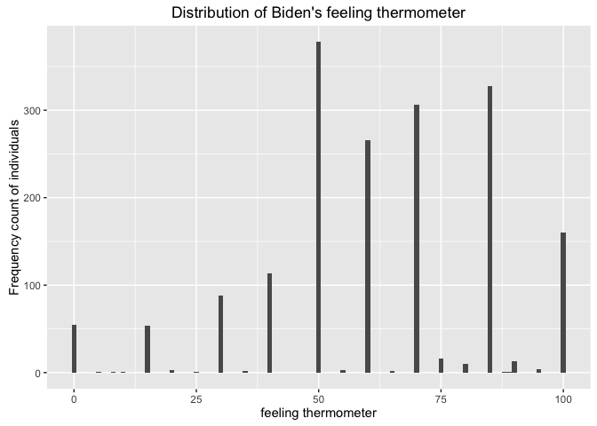
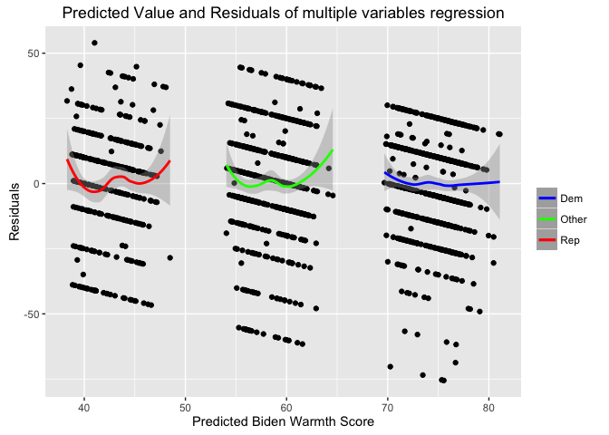

Xu\_Ningyin\_PS5: Linear Regression
================
Ningyin Xu
2/11/2017

-   [Problem 1. Describe the data](#problem-1.-describe-the-data)
-   [Problem 2. Simple linear regression](#problem-2.-simple-linear-regression)
-   [Problem 3. Multiple linear regression](#problem-3.-multiple-linear-regression)
-   [Problem 4. Multiple linear regression with more variables](#problem-4.-multiple-linear-regression-with-more-variables)
-   [Problem 5. Interactive linear regression model.](#problem-5.-interactive-linear-regression-model.)

Problem 1. Describe the data
----------------------------

From the histogram shown above, one can tell most people have high scores (greater than 50) in feeling thermometer for Joe Biden, so most people like him. However, the highest frequency count among all the bins appears in the score of 50, saying the group of people who have indifferent attitude about him is the largest one.

Problem 2. Simple linear regression
-----------------------------------

The summary of simple linear regression is shown as below.

    ## 
    ## Call:
    ## lm(formula = biden ~ age, data = bidendata)
    ## 
    ## Residuals:
    ##     Min      1Q  Median      3Q     Max 
    ## -64.876 -12.318  -1.257  21.684  39.617 
    ## 
    ## Coefficients:
    ##             Estimate Std. Error t value Pr(>|t|)    
    ## (Intercept) 59.19736    1.64792   35.92   <2e-16 ***
    ## age          0.06241    0.03267    1.91   0.0563 .  
    ## ---
    ## Signif. codes:  0 '***' 0.001 '**' 0.01 '*' 0.05 '.' 0.1 ' ' 1
    ## 
    ## Residual standard error: 23.44 on 1805 degrees of freedom
    ## Multiple R-squared:  0.002018,   Adjusted R-squared:  0.001465 
    ## F-statistic: 3.649 on 1 and 1805 DF,  p-value: 0.05626

To make it clearer, the estimates of parameters and their standard errors, R-squared, and adjusted R-squared are the following:

    ##          term    estimate  std.error statistic       p.value
    ## 1 (Intercept) 59.19736008 1.64791889 35.922496 1.145056e-213
    ## 2         age  0.06240535 0.03266815  1.910281  5.625534e-02

    ## [1] 0.002017624

    ## [1] 0.001464725

1&2). One could say there is a relationship between the predictor and the response, since the p-value of age in the summary shows that there are more than 90% chance of rejecting the null hypothesis (no relationship), but statistically speaking the relationship is not very strong/significant, which requires the probability greater than 95%.

3). Positive, the positive sign of the predictor's estimate parameter shows that.

4). The R-squared is about 0.002018, and the adjusted R-squared is about 0.001465. This means only about 0.2% of variation is explained by this model, implying that age alone is not fitting the actual data well (much closer to 0 than 1).

    ##   age .fitted   .se.fit     ymin     ymax
    ## 1  45 62.0056 0.5577123 60.91248 63.09872

5). The predicted "biden" with age of 45 is 62.0056, the associated 95% confidence interval is (60.91248, 63.09872).

6). 

Problem 3. Multiple linear regression
-------------------------------------

    ##          term    estimate  std.error statistic      p.value
    ## 1 (Intercept) 68.62101396 3.59600465 19.082571 4.337464e-74
    ## 2         age  0.04187919 0.03248579  1.289154 1.975099e-01
    ## 3      female  6.19606946 1.09669702  5.649755 1.863612e-08
    ## 4        educ -0.88871263 0.22469183 -3.955251 7.941295e-05

1). From p-values of three predictors, one can tell gender and education have a statistically significant relationship with response since their p-values are both smaller than 0.0001, while age doesn't have a significant with response with a p-value of 0.198.

2). This parameter means the average "biden warmth" increase from male to female. If the repondent is female, the predicted value of "biden warmth" would be 6.196 points higher.

    ## [1] 0.02722727

3). Above is the \(R^2\) of the model. It shows age, gender, and education together could explain 2.7% of variation of actual data. So this model is still not good, but it's better than the age-only model.

4). This model has problems. First, from the plot one can tell there's a clear pattern in scatter points, while a well-fitted model should have residuals randomly located around 0. And the three fitted lines among different party IDs shows that Democrats' predicted warmth score tend to be higher than actual value, while Republicans' score tend to be lower, implying that there's relationship between party IDs and Biden warmth Score that haven't been explained by current model. One could solve the latter problem by adding party ID into the model.

Problem 4. Multiple linear regression with more variables
---------------------------------------------------------

    ##          term     estimate std.error  statistic      p.value
    ## 1 (Intercept)  58.81125899 3.1244366  18.822996 2.694143e-72
    ## 2         age   0.04825892 0.0282474   1.708438 8.772744e-02
    ## 3      female   4.10323009 0.9482286   4.327258 1.592601e-05
    ## 4        educ  -0.34533479 0.1947796  -1.772952 7.640571e-02
    ## 5         dem  15.42425563 1.0680327  14.441745 8.144928e-45
    ## 6         rep -15.84950614 1.3113624 -12.086290 2.157309e-32

1). Comparing to outcomes of problem 2 and 3, the estimate parameter of age changed from 0.0624, 0.0418 to 0.0483, meaning the relationship changed a little. But the p-value is still greater than 0.05, so there's no significant relationship between them.

    ## [1] 0.2815391

2). Above is the \(R^2\) of the model. It shows age, gender, education, and party identification together could explain 28% of variation of actual data. So this model is better than the last one.

3). The second problem has been fixed, now the three fit lines of different party IDs have more similar range of residuals, meaning the relationship between parties and Biden warmth score has been explained well. However, the residuals still has a pattern, which is caused by the age and education variables.

Problem 5. Interactive linear regression model.
-----------------------------------------------

    ##          term  estimate std.error statistic      p.value
    ## 1 (Intercept) 50.197628 0.9218722 54.451833 0.000000e+00
    ## 2      female  5.013504 1.2943063  3.873507 1.111126e-04
    ## 3         dem 22.871908 1.5079013 15.168041 5.322155e-49
    ## 4  female:dem -2.564212 1.9996942 -1.282302 1.999016e-01

    ##   gender      party warmth rating   .se.fit CI_lower_bound CI_upper_bound
    ## 1   Male Republican      50.19763 0.9218722       48.39076       52.00450
    ## 2   Male  Democrats      73.06954 1.1932803       70.73071       75.40837
    ## 3 Female Republican      55.21113 0.9085045       53.43046       56.99180
    ## 4 Female  Democrats      75.51883 0.9484884       73.65979       77.37787

Both relationships differ.

For different genders, the relationship between party ID and Biden warmth seems to be stronger for male. Since male Democrats tend to have 23 (73.07-50.20) points higher Biden warmth comparing to Republicans, while female Democrats are 20 (75.52 - 55.21) points higher than Republicans.

For different parties, the relationship between gender and Biden warmth seems stronger for Republicans. Female Democrats are 2 points higher than male Democrats, but Female Republicans are 5 points higher than male Republicans.
